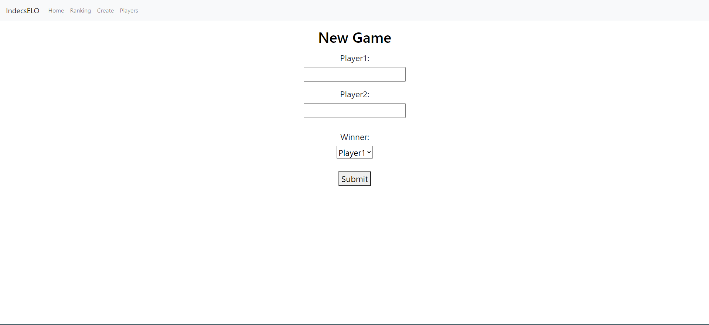
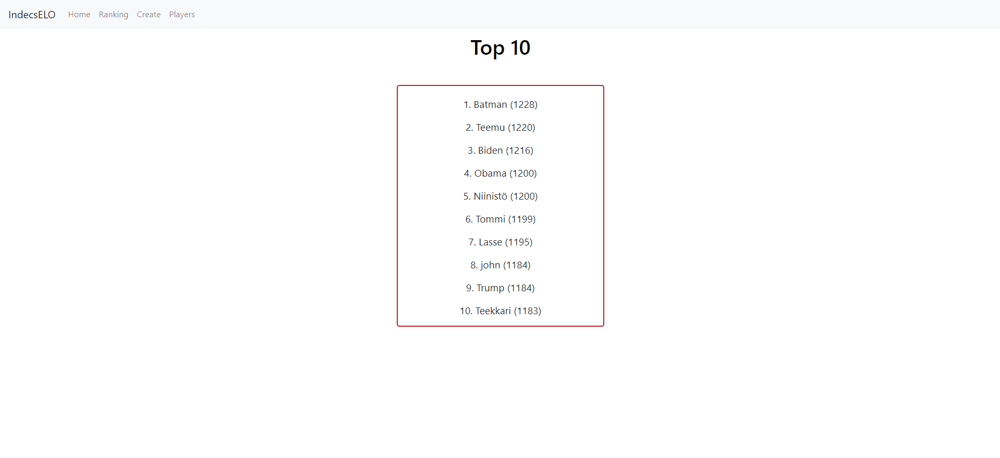
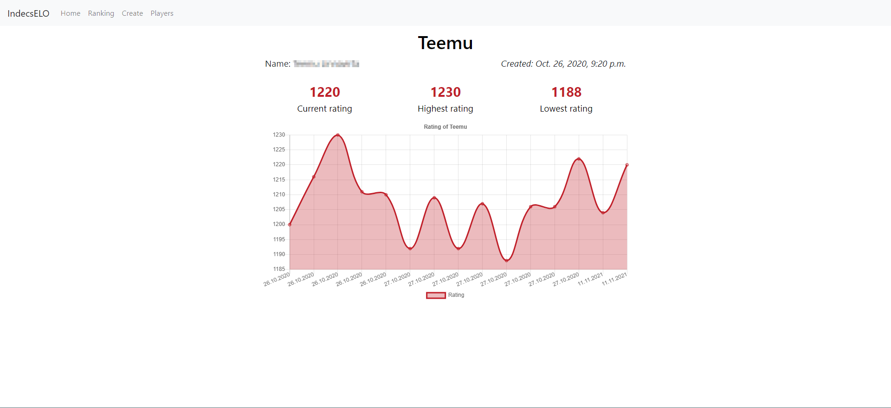

# IndecsChess

Django website where you can create your own chess ELO environment.

## What you can do:
  - Create new players
  - Add games between existing players
    
  - rank players
    
  - Keep track of players development
    

    

    

    
